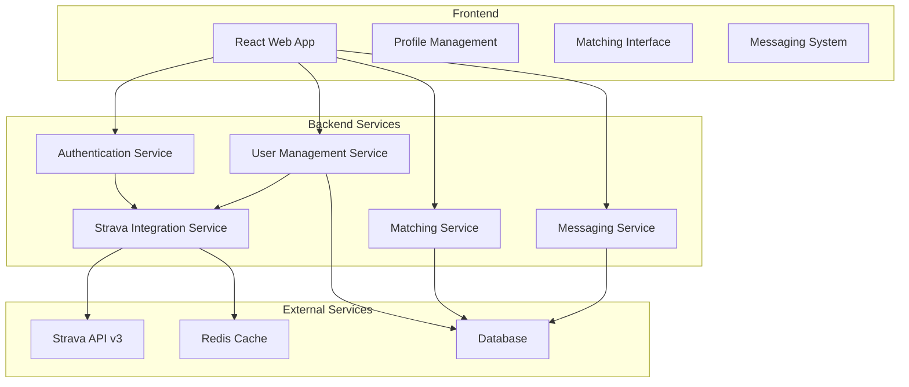
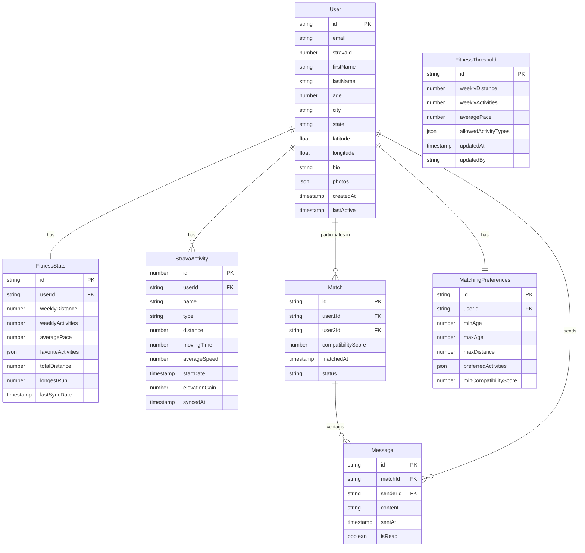

# Design Document

## Overview

The fitness dating app will be built as a modern web application with a React frontend and Node.js backend, integrating with Strava's API v3 for fitness data verification and ongoing profile updates. The system will use a microservices-inspired architecture with clear separation between authentication, user management, Strava integration, and matching services.

The core workflow involves: user registration → Strava OAuth connection → fitness threshold evaluation → profile creation → matching and messaging. The app will maintain real-time fitness data synchronization while respecting Strava's API rate limits and user privacy.

## Architecture

### System Architecture



### Technology Stack

- **Frontend**: React 18 with TypeScript, Tailwind CSS for styling
- **Backend**: Node.js with Express, TypeScript
- **Database**: PostgreSQL for user data, activity history
- **Cache**: Redis for session management and API response caching
- **Authentication**: JWT tokens with refresh token rotation
- **API Integration**: Axios with retry logic for Strava API calls
- **Real-time**: WebSocket connections for messaging

## Components and Interfaces

### Authentication Service

**Purpose**: Handles user registration, login, and Strava OAuth flow

**Key Methods**:
- `initiateStravaAuth()`: Redirects to Strava OAuth
- `handleStravaCallback()`: Processes OAuth callback and exchanges code for tokens
- `validateFitnessThreshold()`: Evaluates user's Strava data against admission criteria
- `createUserAccount()`: Creates account after successful threshold validation

**Interfaces**:
```typescript
interface StravaAuthResponse {
  access_token: string;
  refresh_token: string;
  athlete: StravaAthlete;
}

interface FitnessThreshold {
  weeklyDistance: number; // in meters
  weeklyActivities: number;
  averagePace?: number; // in seconds per km
  activityTypes: string[];
}
```

### Strava Integration Service

**Purpose**: Manages all Strava API interactions, data synchronization, and rate limiting

**Key Methods**:
- `fetchAthleteActivities()`: Retrieves last 90 days of activities
- `calculateFitnessMetrics()`: Processes raw activity data into evaluation metrics
- `refreshStravaTokens()`: Handles token refresh before expiration
- `syncUserActivities()`: Daily sync of new activities for existing users

**Rate Limiting Strategy**:
- Implement exponential backoff for 429 responses
- Queue non-urgent requests during peak hours
- Cache frequently accessed data in Redis with 1-hour TTL

### User Management Service

**Purpose**: Handles user profiles, fitness statistics, and account management

**Key Methods**:
- `createUserProfile()`: Creates profile with Strava data
- `updateFitnessStats()`: Updates profile with latest Strava metrics
- `calculateCompatibilityScore()`: Determines fitness compatibility between users
- `handleAccountDeletion()`: Manages data cleanup including Strava data removal

### Matching Service

**Purpose**: Implements matching algorithm based on fitness compatibility and preferences

**Key Methods**:
- `findPotentialMatches()`: Returns filtered list of compatible users
- `calculateFitnessCompatibility()`: Scores compatibility based on activity overlap
- `applyUserFilters()`: Applies user-specified filters (activity type, distance, etc.)
- `recordMatchInteraction()`: Tracks likes, passes, and matches

**Matching Algorithm**:
1. Filter by basic criteria (age, location, activity preferences)
2. Calculate fitness compatibility score (0-100)
3. Weight by activity type overlap and performance similarity
4. Apply user-specific filters and preferences
5. Return ranked list of potential matches

## Data Models

### Database Schema



### User Model

```typescript
interface User {
  id: string;
  email: string;
  stravaId: number;
  profile: UserProfile;
  fitnessStats: FitnessStats;
  preferences: MatchingPreferences;
  createdAt: Date;
  lastActive: Date;
}

interface UserProfile {
  firstName: string;
  lastName: string;
  age: number;
  location: {
    city: string;
    state: string;
    coordinates: [number, number];
  };
  bio: string;
  photos: string[];
}

interface FitnessStats {
  weeklyDistance: number;
  weeklyActivities: number;
  averagePace: number;
  favoriteActivities: string[];
  totalDistance: number;
  longestRun: number;
  recentActivities: StravaActivity[];
  lastSyncDate: Date;
}
```

### Strava Activity Model

```typescript
interface StravaActivity {
  id: number;
  name: string;
  type: string;
  distance: number;
  movingTime: number;
  averageSpeed: number;
  startDate: Date;
  elevationGain: number;
}
```

### Match Model

```typescript
interface Match {
  id: string;
  user1Id: string;
  user2Id: string;
  compatibilityScore: number;
  matchedAt: Date;
  status: 'active' | 'archived';
}
```

## Error Handling

### Strava API Error Handling

- **Rate Limiting (429)**: Implement exponential backoff with jitter, queue requests
- **Token Expiration (401)**: Automatically refresh tokens, retry original request
- **Service Unavailable (503)**: Display user-friendly message, implement retry logic
- **Invalid Scope (403)**: Guide user through re-authorization process
- **Access Revoked**: When Strava API access is revoked, inform user with clear message: "Your Strava connection has been revoked, and we can no longer access your data" and provide option to reconnect

### Application Error Handling

- **Registration Failures**: Clear messaging about fitness threshold requirements
- **Data Sync Issues**: Graceful degradation, use cached data when possible
- **Matching Service Errors**: Fallback to basic compatibility scoring
- **Database Errors**: Implement circuit breaker pattern, log for monitoring

### User Experience Error Handling

- Loading states during Strava data processing
- Clear progress indicators for lengthy operations
- Helpful error messages with actionable next steps
- Offline capability for basic app functions

## Testing Strategy

### Unit Testing

- **Service Layer**: Mock external API calls, test business logic
- **Strava Integration**: Test data transformation and error handling
- **Matching Algorithm**: Verify compatibility calculations with test data
- **Authentication Flow**: Test OAuth flow with mocked Strava responses

### Integration Testing

- **API Endpoints**: Test complete request/response cycles
- **Database Operations**: Test data persistence and retrieval
- **Strava API Integration**: Test with Strava sandbox environment
- **Real-time Features**: Test WebSocket connections and messaging

### End-to-End Testing

- **User Registration Flow**: Complete Strava OAuth and threshold validation
- **Profile Creation**: Verify Strava data integration and display
- **Matching Process**: Test finding and displaying compatible matches
- **Messaging System**: Test real-time message delivery

### Performance Testing

- **Strava API Rate Limits**: Test queue management and backoff strategies
- **Database Queries**: Optimize matching queries for large user bases
- **Concurrent Users**: Test system behavior under load
- **Data Sync Performance**: Test bulk activity processing efficiency

### Security Testing

- **OAuth Implementation**: Verify secure token handling and storage
- **Data Encryption**: Test encryption of sensitive Strava data
- **API Security**: Test authentication and authorization mechanisms
- **Privacy Controls**: Verify user data deletion and privacy settings